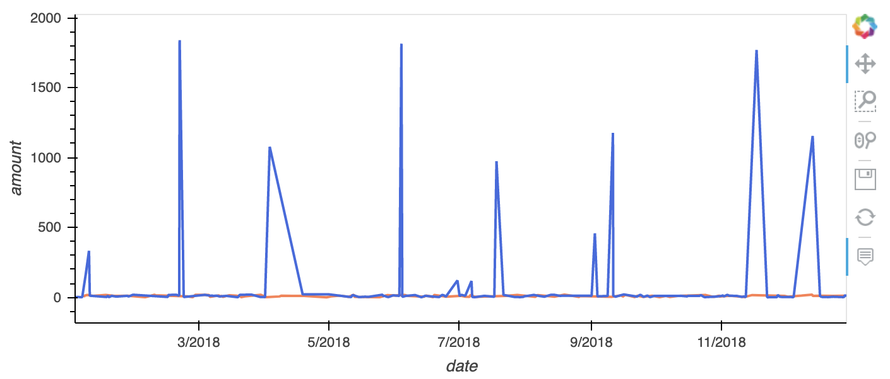

# Looking for Suspicious Activity

*This repository contains the Unit 7 SQL homework assignment, "Looking for Suspicious Activity"  in the FinTech bootcamp course at the University of Toronto's School of Continuing Studies.*

---

## Table of Contents

* [Project Description](#Project-Description)
* [Important Project Note](#Important-Project-Note)
* [Installation Requirements](#Installation-Requirements)
* [File Contents](#File-Contents)
---

## Project Description

The following report analyzes the findings presented in the SQL database model and visual data analysis file to detect potential fraudulent activity within credit card transactions.

### Part 1: Data Modelling

In part 1 of the SQL homework assignment, the creation of an entity relationship diagram occurs using [Quick Database Diagrams](https://www.quickdatabasediagrams.com/). 

### Part 2: Data Engineering

In this section of the project, based on the ERD model, several sql files and a schema are created to assist the analysis development in part three of the assignment. 

### Part 3: Data Analysis

Using the [Visual Data Analysis](visual_data_analysis.ipynb) code file, various visualizations are created to analyze card holder transaction activity. 

---

## Important Project Note

---

## Installation Requirements

---

## File Contents 

---

