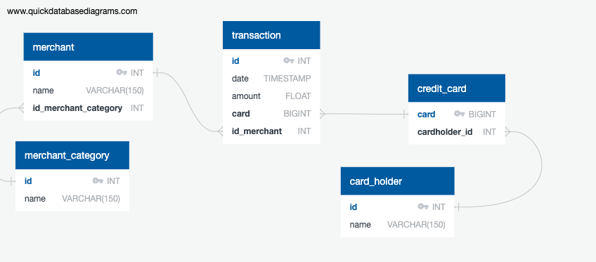

# Looking for Suspicious Activity


*This repository contains the Unit 7 SQL homework assignment, "Looking for Suspicious Activity"  in the FinTech bootcamp course at the University of Toronto's School of Continuing Studies.*

---

## Table of Contents

* [Project Description](#Project-Description)
* [Important Project Note](#Important-Project-Note)
* [Installation Requirements](#Installation-Requirements)
* [File Contents](#File-Contents)
---

## Project Description

The following report analyzes the findings presented in the SQL database model and visual data analysis file to detect potential fraudulent activity within credit card transactions.

### Part 1: Data Modelling

In part 1 of the SQL homework assignment, the creation of an entity relationship diagram occurs using [Quick Database Diagrams](https://www.quickdatabasediagrams.com/). 



### Part 2: Data Engineering

In this section of the project, based on the ERD model, several sql files and a schema are created to assist the analysis development in part three of the assignment. 

### Part 3: Data Analysis

Using the [Visual Data Analysis](visual_data_analysis.ipynb) code file, various visualizations are created to analyze card holder transaction activity. 


---

## Important Project Note

Each table displayed in this report was built using a SQL query through Postgres. The SQL files can be found below or navigated to in the ".sql_files" directory in this repository.

#### SQL Files

* ["Create Tables" Schema](ERD_Files/Schema.sql)
* [Data Seed File](Data/seed.sql)
* [Isolating Crad Holder Transactions](.sql_files/card_holder_transactions.sql)
* [The Top 100 Highest Transactions During 7-9 am](.sql_files/top_100_transactions.sql)
* [Transactions Under $2.00](.sql_files/transactions_under_2_dollars.sql)
* [Verifying Card Holder Transactions](.sql_files/Verifying_Cardholder_Activity.sql)
* [The Top 5 Merchants Prone to Hacking](.sql_files/top_5_merchants_prone_to_hacking.sql)
* [Fraudulent Transactions for Card Holder 2 & 18](.sql_files/cardholders_2_and_18.sql)
* [Fraudulent Transactions for Card Holder 25](.sql_files/cardholder_25.sql)

---

## Installation Requirements

To access the PostgreSQL engine, the user must have their own personal Postgres key. This must be inputted in the [Visual Data Analysis](visual_data_analysis.ipynb) file to display the created visualizations. 

Additionally, users must run a pip install on the following libraries to successfully run the presented code in this assignment. 

```
pip install pandas
pip install matplotlib
pip install plotly
pip install sqlalchemy 
```

---

## File Contents 

* [Unit 7 SQL Homework Instructions](Unit_7_Instructions.md)
* [Visual Data Analysis](visual_data_analysis.ipynb)
* [Data Analysis Report](data_analysis.md)
* [ERD Files](ERD_Files)
* [Data Files](Data)
* [SQL Files](SQL_files)

---

