# Looking for Suspicious Transactions Data Analysis

## Objective 

The following report analyzes the findings presented in the SQL database model and visual data analysis file to detect potential fraudulent activity within credit card transactions.

---

### Important Note

Each table displayed in this report was built using a SQL query through Postgres. The SQL files can be found below or navigated to in the ".sql_files" directory in this repository.

#### SQL Files

* ["Create Tables" Schema](ERD_Files/Schema.sql)
* [Data Seed File](Data/seed.sql)
* [Isolating Crad Holder Transactions](.sql_files/card_holder_transactions.sql)
* [The Top 100 Highest Transactions During 7-9 am](.sql_files/top_100_transactions.sql)
* [Transactions Under $2.00](.sql_files/transactions_under_2_dollars.sql)
* [Verifying Card Holder Transactions](.sql_files/Verifying_Cardholder_Activity.sql)
* [The Top 5 Merchants Prone to Hacking](.sql_files/top_5_merchants_prone_to_hacking.sql)
* [Fraudulent Transactions for Card Holder 2 & 18](.sql_files/cardholders_2_and_18.sql)
* [Fraudulent Transactions for Card Holder 25](.sql_files/cardholder_25.sql)

---

## Data Modeling 

### Entity Relationship Diagram

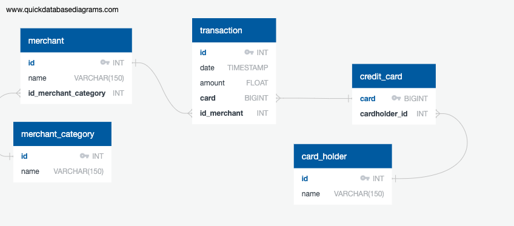

The entity relationship diagram (ERD) model depicts the relationships amongst the tables in the given dataset. 

---

## Isolating Card Holder Transactions

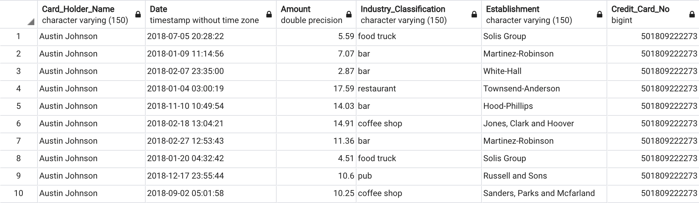

Isolating data variables will organize card holder transaction data and improve the detection process to identify potential anamolies in consumption behaviour.

Using a SQL query, the following card holder database was created to parse data regarding the consumers' spending behaviour within the given parameters of "establishments" and "industry classifications." 

*The below query was used to isolate transactions to card holders*

```
--- Group the transactions for each card holder 
CREATE VIEW Card_Holder_Transactions AS
SELECT card_holder.name AS "Card_Holder_Name"
,transaction.date AS "Date"
,transaction.amount AS "Amount"
,merchant_category.name AS "Industry_Classification"
,merchant.name AS "Establishment"
,credit_card.card AS "Credit_Card_No"

FROM card_holder
INNER JOIN credit_card ON card_holder.id = credit_card.cardholder_id
INNER JOIN transaction ON credit_card.card = transaction.card
INNER JOIN merchant ON transaction.id_merchant = merchant.id
INNER JOIN merchant_category ON merchant.id_merchant_category = merchant_category.id
ORDER BY "Card_Holder_Name";
```

---

## Transactions Analysis

### Top 100 Highest Transactions 

**During a 2 hour time period from 7 am to 9 am the following transactions took place:**

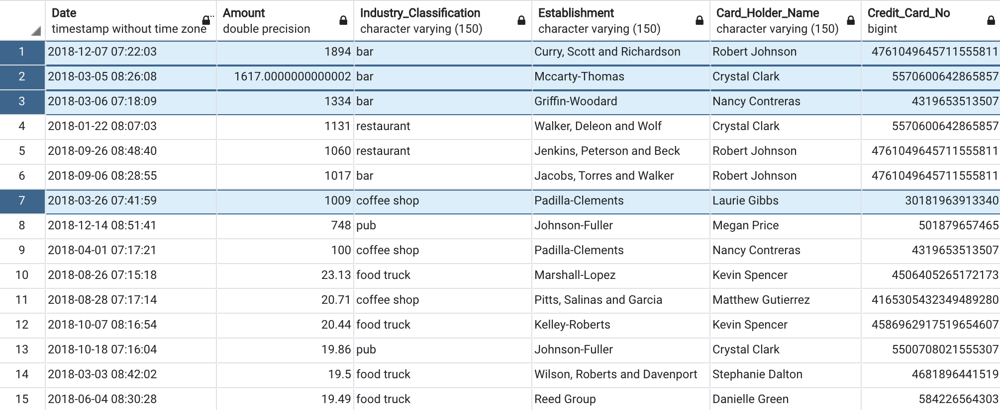

Observed from the highlighted transactions in the above image, several purchases appear suspicious considering the time the transaction occured and the purchase amount.

Based on the industry classification (for example, bars), it is highly unlikely credit card transactions would take place before 9 am. Although the credit card data origin is not specified, according to Ontario Liquor Laws, the earliest a bar can begin serving patrons is 9 am (Alcohol and Gaming Commission of Ontario, 2019). Based on this presented scenario, a data analyst in this region attempting to detect fraudulent activity would question purchases occuring during this time frame.

Overall, the top nine transactions listed above would require verification to determine if the card holder's purchases are legitimate.

### Minimum Transaction Amounts

A strategy common credit card hackers use is making several small purchases, often below two dollars. These transactions are often overlooked by credit card holders, therefore, increasing their exposure to credit card fraud.

**The following card holders experience the most frequent transaction occurences that are less than $2.00:**

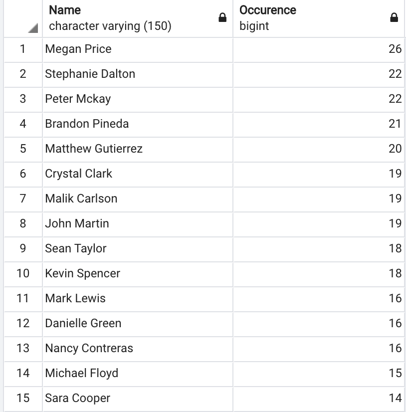

Further analysis is required to determine if the identified card holders are in fact victims of fraudulent activity.

To detect if irregular transactions occured, the first four card holder transaction data is analyzed. Based on the time and location of the transactions, it is evident that these transactions must be verified. Serveral transactions occur at establishments such as bars and  pubs during unusual hours for unjustifiable amounts.

| Verifying Card Holder Activity                      |
------------------------------------------------------|------------------------------------------------------|
| Card Holder: Meagan Price                           |
|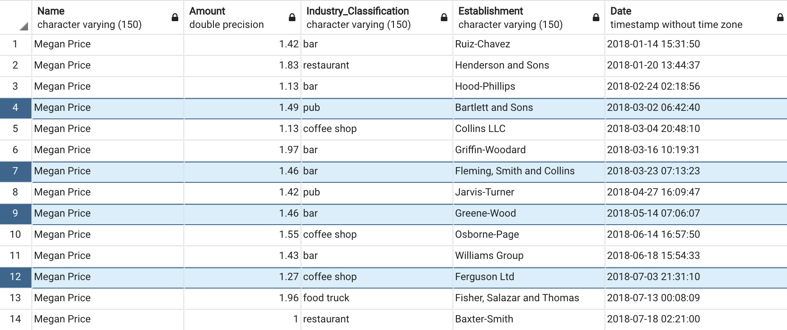             |
| Card Holder: Stephanie Dalton                           |
|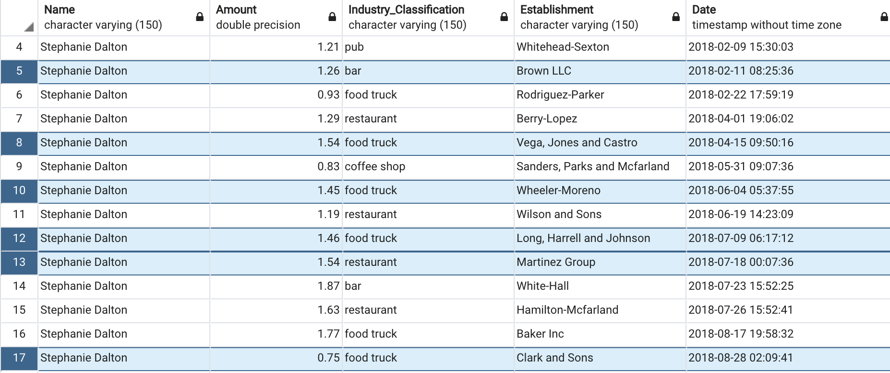             |
| Card Holder: Peter Mckay                           |
|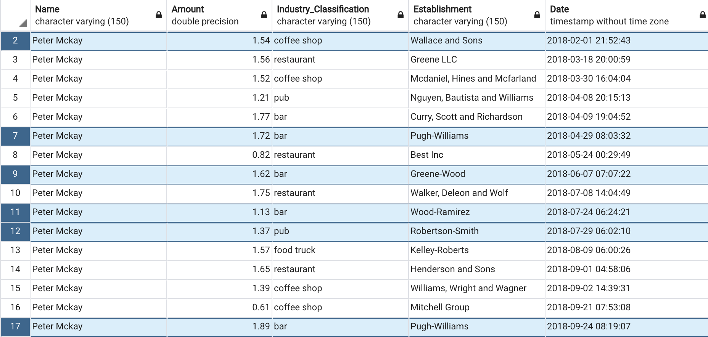             |
| Card Holder: Brandon Pineda                           |
|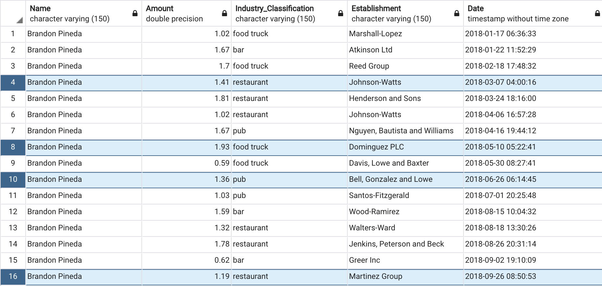             |

### Top 5 Merchants Prone to Being Hacked 

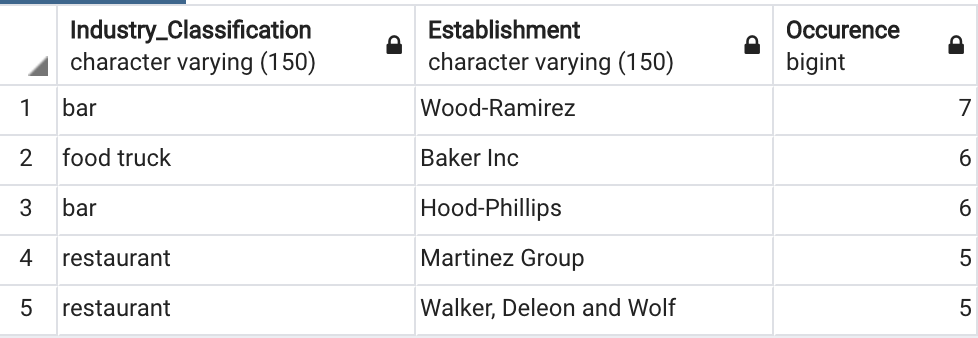

The image above depicts the top 5 merchants prone to being hacked based on a minimum transaction amount of $2.00.

---

## Card Holder Fraudulent Transactions

Pandas, Plotly Express, hvPlot, and SQLAlchemy were used in the visual analysis report to create the visualizations analyzing three card holders spending patterns.

### Line Plot Visual Analysis

#### Card Holder 2

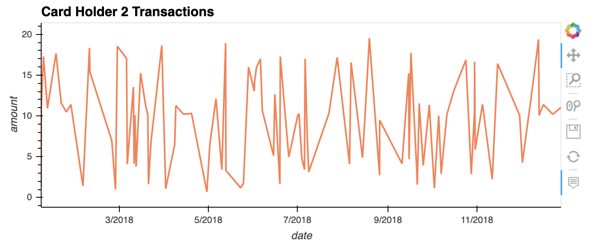

#### Card Holder 18 

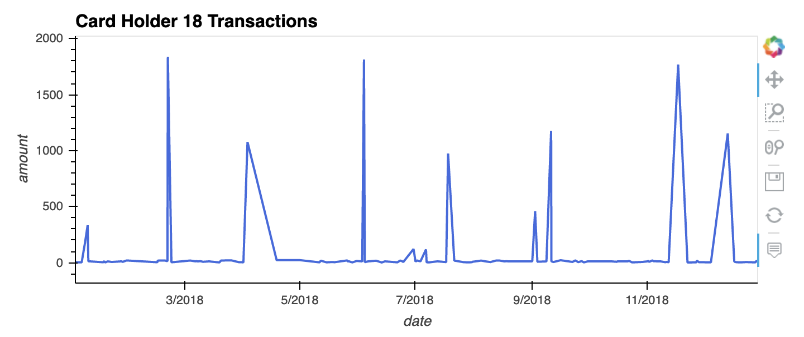

#### Combined Line Plot Analysis

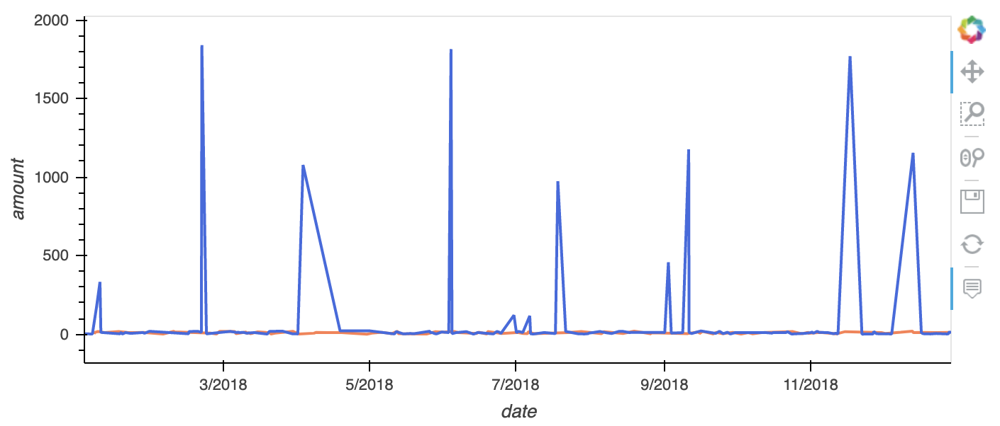


Analyzing the line plots for card holders 2 and 18, it can be concluded that the transaction behaviour for card holder 18 appears irregular. The distribution in transaction amount considering the locations the purchases occur are questionable. Purchases totalling 1000 dollars (plus) are repeated at least once in every one to three month period. However, majority of the transactions that take place during this time frame are significantly lower (purchases on average are under fifteen dollars), indicating there is an outlier in consumption patterns. The sparatic transaction pattern may indicate the firm should conduct an investigation in fraudulent activity or request the card holder verify their transaction statement more frequently. 

Cardholder 2 as noticed from the combined line plot has a much lower spending pattern. The varriance between card holder two's minimum and maximum transaction is an acceptable difference (i.e. does not raise suspicion as the difference between the min and the max is 19 dollars). However, the distribution amount in minimum payments does raise concerns considering transactions under 2 dollars with a frequent occurence most often suggest fradulent activity. 

#### Card Holder 25 

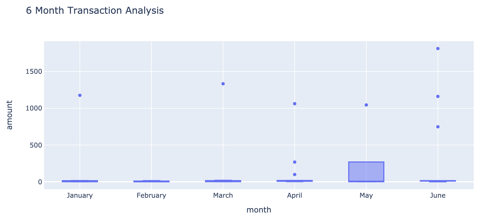

#### Outlier Transactions

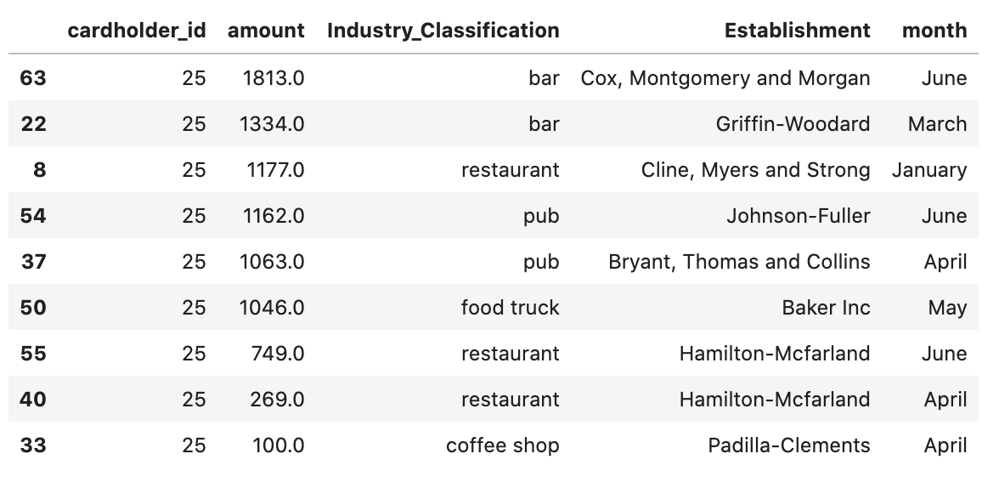

From the displayed box plot over the first six month period of 2018, there appears to be nine outliers present in card holder 25's spending habits. Based on the transaction patters that occured in May and April, there is a possbility the outlier purchases are legitimate. Considering in April there are 2 transactions that are moderate spending prices based on the distribution amount, the card holder may have participated in higher transaction activity for that period. However, considering the varriance in distribution amount it would be beneficial for the firm to verify these transactions with the card holder and investigate suspicions of fradulent activity.

